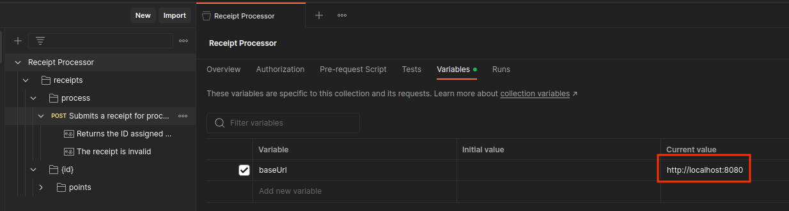

# Receipt Processor Challenge
#### by [carolusquintus](https://github.com/carolusquintus)

This is `receipt-proccess` challenge developed by Carlos Rosas for Fetch Backend Engineer position.

Challenge was developed using:
- Java 17
- Gradle
- Micronaut
- Redis
- Docker

And designed with Hexagonal Architecture and Domain Driven Design.

## Setup local environment

The only assume is that the reviewer has UNIX like OS workstation and Docker.

Open your Terminal and follow next steps.

1. Download SDKMan.
```shell
curl -s "https://get.sdkman.io" | bash
```


2. Install java jdk 17.
```shell
sdk install java 17.0.8-zulu
```


3. Install Gradle.
```shell
sdk install gradle 7.6.1
```


Previous steps are not strictly necessary, because this project uses gradle wrapper.

But there's no reason to take risks :smiley:

4. Clone or paste project in your preferred location.
```shell
git clone https://github.com/carolusquintus/receipt-processor.git
```


5. Move to project.
```shell
cd receipt-processor
```


## Build

Now that your located in the project, there are some small tweaks in order to build it properly.

1. Print your current working directory and copy it.
```shell
pwd
```


2. Open `.env` file located at root project, with your favorite text editor.


3. Replace `PROJECT_DIR` var env with path copied from Build -> Step 1.


4. Replace `DOCKER_USER`var env with your personal or business Docker Hub user.


5. Build `receipt-processor` project.
```shell
gradle build
```
Or
```shell
./gradlew build
```


6. Build and run `docker-compose.yml`
```shell
docker-compose up -d
```


7. Validate that services are up & running.
```shell
docker-compose top
```


## Test

Next steps are for Postman configuration.

1. Import [api.yml](https://raw.githubusercontent.com/fetch-rewards/receipt-processor-challenge/main/api.yml) provided by `receipt-processor-challenge`
```http request
https://raw.githubusercontent.com/fetch-rewards/receipt-processor-challenge/main/api.yml
```


2. Once imported, double click on Receipt Processor collection and go to collection variables tab\
and substitute `baseUrl` Current value with `http://localhost:8080`


3. Open `POST Submits a receipt for processing` request and go to Tests tab.\
Insert this snippet in order to set `receiptId` as a collection variable after each request.
```javascript
var jsonData = pm.response.json();
pm.collectionVariables.set("receiptId", jsonData.id);
```


4. Open `GET Returns the points awarded for the recipt` request and go to Params tab.\
Substitute `id` Path variable with previous `{{receiptId}}`


5. Go back to `POST Submits a receipt for processing` request and copy a json body provided by the challenge\
from `README.md` or [receipt-processor-challenge/examples](https://raw.githubusercontent.com/fetch-rewards/receipt-processor-challenge/main/api.yml)\
Send a request and you will see the UUID response, which will be saved in `{{receipId}}` collections variable.


6. Go to `GET Returns the points awarded for the recipt` request and you will see that current request provides previous UUID saved.\
and also the proper receipt points calculation.


7. Example:


